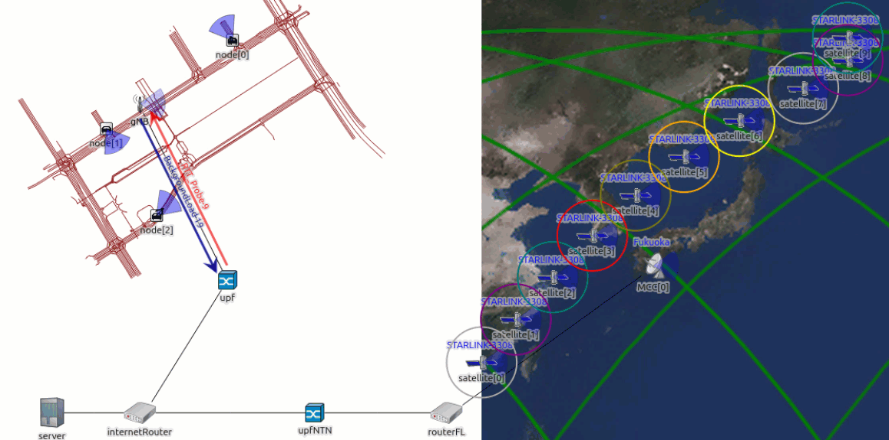
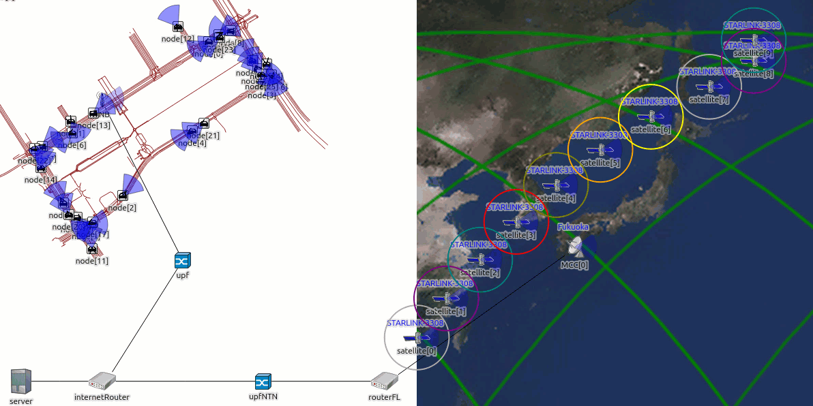

# simu-scs-hybrid

> **Towards 6G**: A co-simulation framework for vehicular networks in hybrid Terrestrial/Non-Terrestrial (TN-NTN) scenarios.

Fork of [simu-scs](https://github.com/ToyotaInfoTech/simu-scs) (Toyota InfoTech) extended with direct Vehicle-to-Satellite (V2S) communication, dual-interface vehicle modules, and intelligent Network Selection strategies for Vertical Handover (VHO) orchestration.

---

## Overview

The original simu-scs framework provides a Bent-Pipe Single-RAT simulation environment in which vehicles communicate via LEO satellites over a cellular backhaul. This fork extends it into a **Bent-Pipe Multi-RAT** architecture, enabling simultaneous 5G NR and direct satellite connectivity on each vehicle node.

| | simu-scs | simu-scs-hybrid |
|---|---|---|
| Architecture | Bent-Pipe Single-RAT | Bent-Pipe Multi-RAT |
| Vehicle Interface | Single (4G cellular) | Dual (4G/5G NR + satellite) |
| V2S Communication | ✗ | ✓ Direct Vehicle-to-Satellite |
| Network Selection | ✗ | ✓ HybridInterfaceManager + 4 strategies |

Based on the research described in:
> Jing Ma, Lei Zhong, and Ryokichi Onishi, "LEO Satellite Communication Simulation Framework for Connected Vehicles," IEEE GLOBECOM 2023.

---

## Demos

**V2S Communication**



**V2N2V Hazard Alert Dissemination**


---

## Key Contributions

### HybridCarV2X

Compound vehicle node (available in LTE variant `HybridCarV2X4G` and 5G NR variant `HybridCarV2X5G`) implementing dual-RAT connectivity:

- **Cellular Interface**: 5G NR protocol stack via Simu5G (`NRUe`), with direct association to a gNodeB.
- **Satellite Interface**: Direct V2S uplink/downlink in Ku-band FDD (UL 14.25/14.5 GHz, DL 10.825/11.075 GHz) via `wlan0` to LEO satellites modelled by leosatellites/os3. Fleet-level channel access uses static two-channel FDMA, partitioning the vehicle fleet into two groups of 50 nodes on separate frequencies to mitigate co-channel interference.
- **Battery Module**: State-of-Charge (SoC) tracking for energy-aware decision making.
- **HybridInterfaceManager**: Orchestrator module implementing the Strategy Pattern for VHO decisions. It evaluates network conditions and delegates the switching decision to one of the four pluggable strategies.

### Network Selection Strategies

Four strategies implement the `ISwitchingStrategy` interface:

| Strategy | Type | Decision Criterion |
|---|---|---|
| **Time-Based** | Deterministic | Periodic interface alternation at a fixed interval (30 s or 60 s). |
| **Coverage-Based** | Reactive (Satellite-First) | Switches to satellite when geometric visibility (elevation angle) is available. |
| **QoS-Based** | Multi-Criteria | Weighted normalised score computed over PDR, RTT, and Jitter. Hysteresis via consecutive-degradation counting prevents oscillation. |
| **Energy-Aware** | Multi-Criteria | Extends QoS-Based by incorporating a battery State-of-Charge term into the utility score, balancing service quality against energy consumption. |

### Extended Network Configurator and Position Converter

The original `SatelliteNetworkConfigurator` (leosatellites) was designed for static topologies. This fork provides an extended `SatelliteNetworkConfiguratorScs` that supports dynamic vehicle entry/exit via an IP pool allocator (two separate subnets: `10.3.0.0/24` for satellite, `10.1.0.0/24` for cellular) and reinstalls routing tables on topology changes.

The `PositionConverter` module was rewritten to auto-parse the SUMO `.net.xml` boundary data, enabling accurate bidirectional conversion between SUMO Cartesian coordinates and geodetic coordinates (latitude/longitude) required by the satellite propagation model.

### Safety-Critical Use Case: V2N2V Alert Dissemination

A custom `AlertServerApp` (extending `UdpBasicApp`) implements a Vehicle-to-Network-to-Vehicle hazard alert dissemination scenario in a satellite-only environment (no terrestrial infrastructure):

- An incident vehicle (`node[0]`) transmits `AlertTriggerPacket` messages to a remote server via the satellite uplink.
- The server preserves the original `CreationTimeTag` from the trigger and rebroadcasts one `AlertPacket` per fleet vehicle, applying a configurable inter-send stagger (default: 1 ms) to prevent MAC queue bursts on the satellite downlink.
- End-to-end latency is measured as `rcvdPkLifetime = simTime_received − triggerCreationTime`, capturing the full V2N2V path.

Evaluation metrics: **Uplink PDR**, **Fleet PDR (FPDR)**, **Time-to-Alert (TTA)**, **Alert Jitter**.

---

## Technology Stack

```
Urban Mobility   : SUMO 1.18           (TraCI co-simulation via Veins)
Simulation Core  : OMNeT++ 6.0.3
Network Layer    : INET 4.4.1
SUMO Bridge      : Veins 5.2
Cellular Stack   : Simu5G 1.2.1        (5G NR / LTE, 3GPP Rel-16)
Orbital Mechanics: OS3 (master) + leosatellites v2.0.0  (SGP4/TLE)
NTN Transport    : simu-scs            (Toyota InfoTech)
```

---

## Prerequisites

### System Requirements

- **OS**: Linux (Ubuntu 20.04+ recommended) or WSL2
- **OMNeT++ 6.0.3**
- **SUMO 1.18**
- **Git** with submodule support

**Framework Dependencies** (auto-installed by `prepare_dependencies.sh`):

| Dependency | Version |
|---|---|
| INET Framework | 4.4.1 |
| Veins | 5.2 |
| Simu5G | 1.2.1 |
| leosatellites | master + v2.0.0 physicallayer |
| os3 | master |

### OMNeT++ 6.0.3 Installation

#### 1. Install System Dependencies

```bash
sudo apt install -y make diffutils pkg-config ccache clang lld gdb lldb \
    bison flex perl sed gawk python3 python3-pip python3-venv python3-dev \
    libxml2-dev zlib1g-dev doxygen graphviz xdg-utils libdw-dev cmake wget \
    openjdk-17-jre openjdk-17-jdk \
    qtbase5-dev qtbase5-dev-tools libqt5svg5 qtwayland5 \
    libwebkit2gtk-4.1-0 libqt5opengl5-dev \
    libopenscenegraph-dev

sudo apt clean
```

Verify Java:
```bash
java -version  # Expected: openjdk version "17.x.x"
```

#### 2. Enable ptrace for Debugging (Optional)

```bash
sudo nano /etc/sysctl.d/10-ptrace.conf
# Set: kernel.yama.ptrace_scope = 0
sudo sysctl --system
```

#### 3. Install Python Dependencies

```bash
python3 -m pip install numpy scipy pandas matplotlib posix_ipc --break-system-packages
```

#### 4. Download and Build OMNeT++ 6.0.3

```bash
# Download from https://github.com/omnetpp/omnetpp/releases/tag/omnetpp-6.0.3
tar xvfz omnetpp-6.0.3-linux-x86_64.tgz
cd omnetpp-6.0.3
source setenv
./configure
make -j$(nproc)

# Verify
cd samples/aloha && ./aloha
```

> **Note**: Run `source setenv` in every new terminal, or persist it:
> ```bash
> echo "source ~/omnetpp-6.0.3/setenv" >> ~/.bashrc
> ```

---

## Installation

### 1. Clone the Repository

```bash
git clone --recursive https://github.com/squidslab/simu-scs-hybrid.git
cd simu-scs-hybrid
```

### 2. Install Framework Dependencies

```bash
./prepare_dependencies.sh
```

Downloads and patches INET 4.4.1, Veins 5.2, Simu5G 1.2.1, leosatellites, and os3.

### 3. Import into OMNeT++ IDE

1. Launch **OMNeT++ IDE** and create a new workspace.
2. When prompted to install the INET Framework: ⚠️ **DO NOT INSTALL** — uncheck both options. The project requires INET 4.4.1 installed by `prepare_dependencies.sh`; the bundled IDE version will break the build.
3. **File → Import → Existing Projects into Workspace**
4. Select `simu-scs-hybrid/` as root, check all projects, click **Finish**.
5. Wait for indexing to complete before building.

### 4. Build

```
Project → Build All
```

---

## Simulation Scenarios

### Evaluation Setup

All scenarios reproduce a dense urban vehicular environment mapped to the **Minato ward, Tokyo metropolitan area** (approximately 1080 m × 1080 m, imported from OpenStreetMap via SUMO). Orbital trajectories are computed using the SGP4 propagation model from real Starlink TLE data (`starlink2023.txt`), with 10 satellites distributed across 2 orbital planes.

| Parameter | Value |
|---|---|
| Vehicle nodes (HybridCarV2X UE) | 100 |
| 5G Base Station (gNB) | 1 (Minato ward) |
| LEO Constellation | 10 Starlink satellites — 2 orbital planes |
| Ground Station / MCC | 1 (Fukuoka, 33.591° N 130.401° E, ≈ 900 km from Minato) |
| Evaluation duration | 400 s |

Each vehicle runs two applications:
- **BackgroundLoadApp** — sensor data upload to server (1024 B/packet, `exponential(500 ms)` inter-packet interval)
- **ProbeApp** — RTT measurement probe to `UdpEchoApp` on server (100 B/packet, `exponential(1000 ms)` inter-packet interval)

The exponential inter-packet distribution models Poisson-arrival traffic, preventing artificial synchronisation artifacts that would arise with deterministic periodic transmission.

Two traffic conditions are evaluated:

| Scenario | Mean Interval | Characterisation |
|---|---|---|
| Nominal | 500 ms | Light load |
| Congested | 100 ms | Heavy load, cellular saturation |

### Safety-Critical Scenario (V2N2V)

Satellite-only scenario simulating a hazard event in an area without terrestrial infrastructure:

| Parameter | Value |
|---|---|
| Vehicle nodes | 25 |
| LEO Constellation | 10 Starlink satellites |
| Trigger send interval | 100 ms (node[0] → server) |
| Alert inter-send stagger | 1 ms (server → fleet) |
| Safety TTA threshold | 500 ms |

---

## Running Simulations

All commands run from:
```bash
samples-scs-hybrid/SatelliteVehicleHybridSample/HybridSCSV5GFusion/
```

### Available Configurations

#### Baseline

| Config | Interface | Description |
|---|---|---|
| `CellularOnly` | 5G NR only | Terrestrial Single-RAT baseline |
| `SatelliteOnly` | LEO satellite only | NTN Single-RAT baseline |
| `SatelliteOnlyAlert` | LEO satellite only | V2N2V safety-critical scenario |

#### Network Selection Strategies

| Config | Strategy | VHO Trigger |
|---|---|---|
| `TimeBasedSwitching` | Time-Based | Periodic timer (30 s / 60 s) |
| `CoverageBasedSwitching` | Coverage-Based | Satellite geometric visibility |
| `QoSBasedSwitching` | QoS-Based | PDR / RTT / Jitter weighted score |
| `EnergyAwareSwitching` | Energy-Aware | QoS score + battery SoC |

### Running a Simulation

**Step 1** — Start SUMO:
```bash
sumo --remote-port 9999 --num-clients 1 -c sumodir/config.sumocfg
```

**Step 2** — Run OMNeT++ in CMDENV (recommended):
```bash
../../samples-scs-hybrid_dbg -u Cmdenv -m -c CellularOnly omnetpp.ini
```

**Step 3** — Or use the helper script:
```bash
./run.sh -c CellularOnly
./run.sh -help    # list all options
```

> For complete library path flags and batch run commands see `commands.sh`.

### Simulation Output

Results are written to `results/`:

| Extension | Content |
|---|---|
| `.sca` | Scalar results (end-of-run statistics) |
| `.vec` | Vector results (time-series data) |
| `.vci` | Vector index |
| `.elog` | Event log (if enabled) |

Post-processing Python scripts (using `omnetpp.scave`) are provided for PDR, RTT, Jitter, QoS score, energy consumption, and V2N2V metrics.

---

## Known Limitations

**1. Transparent (bent-pipe) payload architecture.**
The framework models a transparent satellite payload: the satellite relays signals between the vehicle (Service Link, Ku-band) and the Ground Station (Feeder Link, Ka-band 28.5 GHz) without on-board processing. Regenerative payload architectures  where the satellite hosts an on-board gNB and the 3GPP Uu interface terminates in orbit  are not supported.

**2. Single-cell terrestrial segment.**
The scenario uses a deliberately simplified single-cell architecture with one gNodeB. All 100 vehicle UEs are statically associated to `macCellId = 1`. Inter-cell Horizontal Handover is not evaluated; PDR figures for the cellular segment represent a best-case upper bound for a real multi-cell deployment.

**3. Static FDMA uplink access (no deterministic scheduling).**
The satellite uplink divides the vehicle fleet into two static FDMA groups of 50 nodes each (Channel 0: 14.250 GHz UL; Channel 1: 14.500 GHz UL). This is a deliberate methodological choice. The resulting collision rate on the shared uplink is higher than what a TDMA/OFDMA system with centralised scheduling would produce; satellite PDR values (~90%) should therefore be interpreted as a conservative lower bound of what a real NTN access layer would achieve with deterministic channel access.

**4. Break-Before-Make Vertical Handover (Hard VHO).**
All interface transitions, including intra-constellation Horizontal Satellite Handovers and vertical TN↔NTN transitions, follow a Break-Before-Make discipline. The vehicle disconnects from the outgoing interface before establishing the incoming one, generating a blind window during which routing table reconvergence produces packet loss. Make-Before-Break (soft handover) is a direction for future work.

---

## Contributing

This repository is part of active academic research. Bug reports and pull requests are welcome via GitHub Issues.

> ⚠️ This fork may contain bugs and is **not** an official release. It is intended for research purposes only. If you find any issues, please report them via GitHub Issues.
---

## License

Inherits **LGPL-3.0-or-later** from the original simu-scs framework.

```
Copyright (C) 2023 TOYOTA MOTOR CORPORATION
SPDX-License-Identifier: LGPL-3.0-or-later
```

---

## Credits

- **Original Framework**: [simu-scs](https://github.com/ToyotaInfoTech/simu-scs) — Toyota InfoTech
- **Fork Maintainer**: [Giuseppe Balzano](https://github.com/Balzakrez) — SQuIDS Lab, Università degli Studi di Napoli Federico II

---

## Related Projects

simu-scs-hybrid is built as a layered composition of five independent frameworks.
SUMO generates vehicle trajectories that Veins feeds into OMNeT++ via TraCI;
INET provides the foundational network stack on top of which Simu5G implements
the 5G NR cellular segment and leosatellites/os3 implement the LEO satellite segment.

| Framework | Version | Integration Point |
|---|---|---|
| [INET](https://github.com/inet-framework/inet) | 4.4.1 | Foundation layer: IP stack, physical layer models, node mobility, UDP/TCP |
| [os3](https://github.com/inet-framework/os3) | master | SGP4 orbital mechanics and NORAD TLE parsing for satellite trajectory computation |
| [leosatellites](https://github.com/Avian688/leosatellites) | v2.0.0 (phy) + master | LEO constellation physical layer and `SatelliteNetworkConfigurator` (extended in this fork) |
| [Veins](https://github.com/sommer/veins) | 5.2 | Bidirectional SUMO–OMNeT++ co-simulation bridge via TraCI protocol |
| [Simu5G](https://github.com/Unipisa/Simu5G) | 1.2.1 | 5G NR / LTE protocol stack — `NRUe` is the base type for `HybridCarV2X5G` |